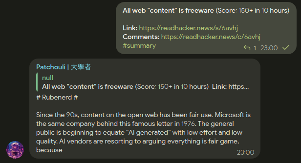

# Patchouli

Summarise articles with ease.  
This is my first nodejs & typescript project, which means there can be many unhealthy typescript codes. Thus, be cautious to potential bugs.

I won't release until the codebase is ready.

# Installation

You should have nodejs installed.

```bash
git clone https://github.com/iceBear67/patchouli-bot
cd patchouli-bot
npm install
npm run bot
```

For the first run, the bot will generate a `config.toml` file where you can adjust some parameters.  
At least the `botToken`,`modelConfig.accessToken`, which you can get from [@botfather](https://t.me/botfather) and the
provider of `backend`, should be provided.

# Usage

Patchouli supports channel posts and general messages (group & DM).

If there are messages that are tagged with `hashtagTriggers` or replied with `/summary`, patchouli will try to fetch the first URL it sees in the message and start generating the summary.

By the way, patchouli doesn't handle concurrent requests very well at the moment, so you should be aware of the possible request flooding.

# Commands

1. `summary [url]` url is not required if you're using replying feature.
2. `invalidate <pattern>` invalidate cached summaries in the database cache.

There are currently no permissions to prevent these commands from being abused.
# Screenshot

